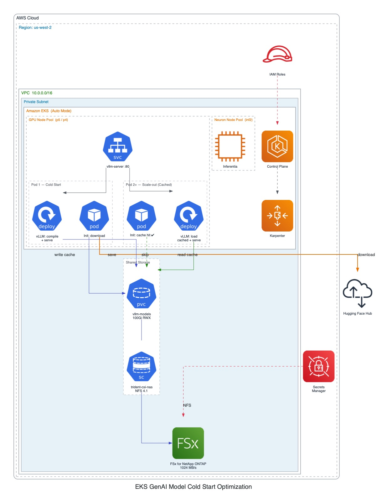

# EKS GenAI Model Cold Start Optimization

This project demonstrates optimized cold start strategies for GenAI models running on Amazon EKS with GPU support. It focuses on reducing model loading times during scale-out by caching model weights and torch compilation artifacts on shared persistent storage, so that new pods skip downloading and compiling entirely.

## Overview

When scaling vLLM inference workloads on Kubernetes, every new pod typically needs to download model weights from Hugging Face and compile torch kernels — a process that can take 2-3 minutes. This project eliminates that cost for scale-out pods using shared persistent storage (FSx for NetApp ONTAP) and a smart caching strategy.

The solution provides:
- EKS cluster with GPU node pools using Karpenter for auto-scaling
- Optimized vLLM deployment with shared model and compilation caching
- Smart init container that skips downloads when the cache is warm
- FSx for NetApp ONTAP with tuned NFS mount options for high-throughput reads
- Startup probes for accurate readiness detection without artificial delays
- Benchmark script to measure and compare cold start vs cached scale-out performance
- Support for both GPU (NVIDIA) and Neuron (AWS Inferentia) workloads

## Architecture



```
┌─────────────────────────────────────────────────────────────────────────────────────┐
│  AWS VPC                                                                            │
│                                                                                     │
│  ┌────────────────────────────────────────────────────────────────────────────────┐  │
│  │  EKS Cluster (Auto Mode)                                                      │  │
│  │                                                                                │  │
│  │  ┌──────────────────────────────────────┐   ┌───────────────────────────────┐  │  │
│  │  │  Karpenter GPU Node Pool (p5/p4)     │   │  Karpenter Neuron Node Pool   │  │  │
│  │  │                                      │   │  (inf2)                       │  │  │
│  │  │  ┌──────────────────────────────┐    │   │                               │  │  │
│  │  │  │ Pod 1 (First - Cold Start)   │    │   │  ┌─────────────────────────┐  │  │  │
│  │  │  │                              │    │   │  │ Neuron Pod              │  │  │  │
│  │  │  │  ┌────────────────────────┐  │    │   │  │ (future workloads)      │  │  │  │
│  │  │  │  │ Init: model-downloader │──┼────┼───┼──┼──── Hugging Face Hub    │  │  │  │
│  │  │  │  │ (downloads if needed)  │  │    │   │  └─────────────────────────┘  │  │  │
│  │  │  │  └──────────┬─────────────┘  │    │   │                               │  │  │
│  │  │  │             ▼                │    │   └───────────────────────────────┘  │  │
│  │  │  │  ┌────────────────────────┐  │    │                                      │  │
│  │  │  │  │ vLLM Server            │  │    │                                      │  │
│  │  │  │  │ • Load weights ────────┼──┼──┐ │                                      │  │
│  │  │  │  │ • Compile torch ───────┼──┼──┤ │                                      │  │
│  │  │  │  │ • Serve inference      │  │  │ │                                      │  │
│  │  │  │  └────────────────────────┘  │  │ │                                      │  │
│  │  │  └──────────────────────────────┘  │ │                                      │  │
│  │  │                                    │ │                                      │  │
│  │  │  ┌──────────────────────────────┐  │ │                                      │  │
│  │  │  │ Pod 2+ (Scale-out - Cached)  │  │ │                                      │  │
│  │  │  │                              │  │ │                                      │  │
│  │  │  │  ┌────────────────────────┐  │  │ │                                      │  │
│  │  │  │  │ Init: model-downloader │  │  │ │                                      │  │
│  │  │  │  │ (cache hit → skip) ✓   │  │  │ │                                      │  │
│  │  │  │  └──────────┬─────────────┘  │  │ │                                      │  │
│  │  │  │             ▼                │  │ │                                      │  │
│  │  │  │  ┌────────────────────────┐  │  │ │                                      │  │
│  │  │  │  │ vLLM Server            │  │  │ │                                      │  │
│  │  │  │  │ • Load cached weights ─┼──┼──┤ │                                      │  │
│  │  │  │  │ • Reuse compiled cache ┼──┼──┤ │                                      │  │
│  │  │  │  │ • Serve inference      │  │  │ │                                      │  │
│  │  │  │  └────────────────────────┘  │  │ │                                      │  │
│  │  │  └──────────────────────────────┘  │ │                                      │  │
│  │  │                                    │ │                                      │  │
│  │  └────────────────────────────────────┘ │                                      │  │
│  │                                         │                                      │  │
│  │  ┌──────────────────────────────────────┘                                      │  │
│  │  │  Trident CSI (NFS 4.1, 1MB r/w buffers)                                    │  │
│  │  │                                                                              │  │
│  └──┼──────────────────────────────────────────────────────────────────────────────┘  │
│     │                                                                                 │
│     ▼                                                                                 │
│  ┌──────────────────────────────────────────────────────────────────┐                  │
│  │  FSx for NetApp ONTAP (1024 MB/s)                               │                  │
│  │                                                                  │                  │
│  │  PVC: vllm-models (100Gi, ReadWriteMany)                        │                  │
│  │  ┌─────────────────────────┐  ┌──────────────────────────────┐  │                  │
│  │  │ /huggingface            │  │ /vllm                        │  │                  │
│  │  │  └─ hub/models--*       │  │  └─ torch_compile_cache/     │  │                  │
│  │  │     └─ snapshots/       │  │     └─ compiled kernels      │  │                  │
│  │  │        └─ model weights │  │        (reused by all pods)  │  │                  │
│  │  └─────────────────────────┘  └──────────────────────────────┘  │                  │
│  └──────────────────────────────────────────────────────────────────┘                  │
│                                                                                       │
└───────────────────────────────────────────────────────────────────────────────────────┘

Cold Start Flow:
  Pod 1:  Download model ──▶ Load weights ──▶ Compile torch ──▶ Save to PVC ──▶ Ready (~100s)
  Pod 2+: Cache hit (skip) ──▶ Load from PVC ──▶ Reuse compiled ──▶ Ready (~77s)
```

### Key Components
- **EKS Cluster**: Kubernetes cluster with auto-mode enabled
- **Karpenter Node Pools**: Dynamic provisioning of GPU and Neuron instances
- **vLLM Server**: High-performance inference server for LLMs (Ministral-3-14B)
- **FSx for NetApp ONTAP**: High-throughput persistent storage (1024 MB/s) for model caching
- **Persistent Volumes**: ReadWriteMany volumes caching model weights, tokenizer artifacts, and torch compilation output
- **Trident CSI**: NetApp's CSI driver with NFS mount options tuned for large sequential reads

### How Caching Works

1. **First pod** deploys and the init container downloads the model to the shared PVC. vLLM loads the weights, compiles torch kernels, and saves the compilation cache to the PVC.
2. **Scale-out pods** start, the init container detects the model is already cached and exits immediately. vLLM loads weights from the PVC and reuses the pre-compiled torch cache — skipping both the download and compilation steps.

### Supported Instance Types
- **GPU**: p5, p4 families
- **Neuron**: inf2 family

## Prerequisites

- AWS CLI configured with appropriate credentials
- Terraform >= 1.0
- kubectl
- Helm 3.x
- Access to AWS region with GPU instance availability
- Hugging Face API token (for model downloads)

## Project Structure

```
eks-genai-model-coldstart/
├── terraform/                          # Infrastructure as Code
│   ├── eks-cluster.tf                  # EKS cluster configuration
│   ├── nodepool_automode.tf            # Karpenter node pool configs (GPU + Neuron)
│   ├── fsx.tf                          # FSx for NetApp ONTAP (1024 MB/s throughput)
│   ├── trident.tf                      # Trident CSI driver + backend config
│   ├── kubernetes.tf                   # K8s provider configuration
│   ├── vpc.tf                          # VPC with public/private subnets
│   ├── iam.tf                          # IAM roles and policies
│   ├── security-groups.tf              # Security groups for FSx access
│   ├── variables.tf                    # Input variables
│   ├── outputs.tf                      # Output values
│   ├── versions.tf                     # Provider versions
│   └── values.yaml                     # Trident Helm chart values
├── manifests/                          # Kubernetes manifests
│   ├── deploymentgpu.yaml              # vLLM deployment with caching
│   ├── deploymentgpu-nocache.yaml      # vLLM deployment without caching (for benchmarking)
│   ├── modelstorage.yaml               # PVC for model cache (100Gi ReadWriteMany)
│   ├── storageclass.yaml               # Trident NAS storage class with NFS tuning
│   └── backendnas.yaml.tpl             # Trident backend config template
├── scripts/
│   └── benchmark-coldstart.sh          # Cold start benchmark script
└── README.md
```

## Deployment

### 1. Infrastructure Setup

Configure your Terraform variables:

```bash
export TF_VAR_aws_region="us-west-2"
```

Deploy the infrastructure:

```bash
cd terraform
terraform init
terraform plan
terraform apply
```

This will provision:
- EKS cluster with auto-mode enabled
- VPC with public/private subnets
- FSx for NetApp ONTAP filesystem (1024 MB/s throughput)
- Karpenter node pools for GPU and Neuron instances
- Trident CSI driver with NAS backend
- Storage class with optimized NFS mount options
- Required IAM roles, policies, and security groups

### 2. Configure kubectl

```bash
aws eks update-kubeconfig --region $TF_VAR_aws_region --name <cluster-name>
```

### 3. Create Secrets

```bash
# Create Hugging Face token secret
kubectl create secret generic hf-token-secret \
  --from-literal=token=$HF_TOKEN \
  -n genai
```

### 4. Deploy Storage Resources

```bash
kubectl apply -f manifests/modelstorage.yaml
```

### 5. Deploy vLLM Server

```bash
kubectl apply -f manifests/deploymentgpu.yaml
```

The first pod will download the model and populate the cache. Subsequent pods (via scaling) will use the cached weights and compilation artifacts.

## Cold Start Optimization Strategies

### 1. Shared Model and Compilation Cache

The deployment mounts a ReadWriteMany PVC to cache:
- Downloaded model weights (`/root/.cache/huggingface`)
- Torch compilation cache and engine artifacts (`/root/.cache/vllm`)

The init container checks if the model is already present before downloading:
```yaml
if [ -d "$MODEL_DIR/snapshots" ] && [ "$(ls "$MODEL_DIR/snapshots")" ]; then
  echo "Model already cached, skipping download"
else
  hf download "$MODEL_ID"
fi
```

### 2. NFS Mount Tuning

The storage class uses optimized NFS mount options for maximum throughput when loading large model weight files:
```yaml
mountOptions:
  - hard
  - nfsvers=4.1
  - rsize=1048576    # 1MB read buffer
  - wsize=1048576    # 1MB write buffer
```

### 3. Startup Probes

Instead of fixed `initialDelaySeconds` (which adds an artificial floor to readiness time), the deployment uses a `startupProbe` that checks `/health` every 10 seconds. Once the server is actually ready, Kubernetes knows within seconds rather than waiting a fixed delay.

### 4. Environment Variable Tuning

| Variable | Value | Purpose |
|---|---|---|
| `TRANSFORMERS_OFFLINE` | `1` | Skips network checks on cached models (~3-5s saved) |
| `HF_HUB_ENABLE_HF_TRANSFER` | `1` | Rust-based parallel downloads for ~5x faster initial pull |

### 5. vLLM Server Flags

| Flag | Purpose |
|---|---|
| `--gpu-memory-utilization 0.95` | Uses more VRAM for KV cache (default 0.9) |
| `--enable-chunked-prefill` | Enables chunked prefill for better throughput |
| `--max_num_batched_tokens 1024` | Controls batch size for prefill |
| `--enforce-eager` | (Optional) Skips torch compilation for fastest startup at the cost of inference throughput |

## Benchmarking

The project includes a benchmark script that measures cold start vs cached scale-out performance.

### Usage

```bash
# Compare both cached and nocache variants (default)
./scripts/benchmark-coldstart.sh

# Test only the cached variant
./scripts/benchmark-coldstart.sh --mode cached

# Test only the nocache variant
./scripts/benchmark-coldstart.sh --mode nocache

# Scale to 3 replicas instead of 2
./scripts/benchmark-coldstart.sh --mode cached --scale-to 3

# Clean up deployments after benchmarking
./scripts/benchmark-coldstart.sh --mode both --cleanup

# Set a custom timeout (default: 600s)
./scripts/benchmark-coldstart.sh --timeout 900
```

### Options

| Flag | Default | Description |
|---|---|---|
| `--mode` | `both` | `cached`, `nocache`, or `both` |
| `--scale-to` | `2` | Number of replicas to scale to |
| `--timeout` | `600` | Max seconds to wait per phase |
| `--cleanup` | off | Delete deployments after benchmarking |

### How It Works

The benchmark runs in two phases per variant:

1. **Phase 1 — First pod (cold start)**: Deploys 1 replica, streams logs in real-time, and measures wall-clock time from `kubectl apply` to vLLM reporting ready.
2. **Phase 2 — Scale-out**: Scales the deployment to N replicas, identifies the new pod, streams its logs, and measures how quickly it starts with (or without) the shared cache.

In `both` mode, it runs nocache first (to avoid benefiting from any warm state), then cached, and prints a comparison table.

### Example Output

```
================================================================
  Cold Start vs Cached Scale-Out: Full Comparison
================================================================

                              No Cache        With Cache
  ----------------------------  --------------  --------------
  First pod (cold start)        172s            100s
  Scale-out pod                 114s            77s

  Cache scale-out advantage: 1.5x faster than nocache scale-out
  Cached first -> scale-out:  1.3x faster with warm cache

  Full logs saved to:
    /tmp/benchmark_cached_first_pod.txt
    /tmp/benchmark_cached_scaleout_pod.txt
    /tmp/benchmark_nocache_first_pod.txt
    /tmp/benchmark_nocache_scaleout_pod.txt
```

### Log Files

The benchmark saves full vLLM startup logs for each phase to `/tmp/benchmark_<variant>_<phase>_pod.txt`. These logs contain detailed timing for model weight loading, torch compilation, and server initialization.

## Configuration

### Node Pool Configuration

The project includes two Karpenter node pools defined in `nodepool_automode.tf`:

1. **GPU Node Pool**:
   - Instance families: p5, p4
   - Architecture: amd64
   - Capacity types: spot, on-demand
   - Taint: `nvidia.com/gpu=Exists:NoSchedule`
   - Labels: `owner=data-engineer`, `instanceType=gpu`
   - Max nodes: 4

2. **Neuron Node Pool**:
   - Instance families: inf2
   - Capacity types: spot, on-demand
   - Taint: `aws.amazon.com/neuron=Exists:NoSchedule`
   - Labels: `owner=data-engineer`, `instanceType=neuron`

### Storage Configuration

- **FSx ONTAP**: 2048 GiB capacity, 1024 MB/s throughput, SINGLE_AZ_1
- **Storage Class**: `trident-csi-nas` with NFS 4.1, 1MB read/write buffers
- **PVC**: 100Gi ReadWriteMany (adjustable based on model size)

### Terraform Variables

| Variable | Default | Description |
|---|---|---|
| `kubernetes_version` | `1.32` | EKS Kubernetes version |
| `vpc_cidr` | `10.0.0.0/16` | VPC CIDR range |
| `aws_region` | `us-west-2` | AWS region |
| `enable_auto_mode_gpu` | `true` | Enable GPU node pool |
| `enable_auto_mode_neuron` | `false` | Enable Neuron node pool |
| `enable_auto_mode_node_pool` | `true` | Enable Karpenter node pools |

## Troubleshooting

### Pod Stuck in Init

If the init container is failing, check its logs:
```bash
kubectl logs -n genai <pod-name> -c model-downloader
```

Common issues:
- Invalid Hugging Face token — verify the `hf-token-secret` secret
- PVC not mounted — check `kubectl get pvc -n genai`
- Model ID changed — update the hardcoded cache path in the init container

### Startup Probe Failures

If the pod is killed during startup (e.g. for very large models), increase the startup probe budget:
```yaml
startupProbe:
  failureThreshold: 60  # allows up to 600s (10min)
```

### GPU Memory Issues

```bash
# Check GPU utilization
kubectl exec -n genai deployment/vllm-server -- nvidia-smi

# Reduce model context length if OOM
args: ["vllm serve model --max-model-len 16384"]
```

### Storage Performance

```bash
# Check PVC status
kubectl get pvc -n genai

# Verify Trident backend
kubectl get tridentbackends -n trident
```

## Usage

### Accessing the vLLM Server

```bash
# Port-forward for local testing
kubectl port-forward -n genai svc/vllm-server 8000:80

# Test completion
curl http://localhost:8000/v1/completions \
  -H "Content-Type: application/json" \
  -d '{
    "model": "mistralai/Ministral-3-14B-Instruct-2512",
    "prompt": "Hello, how are you?",
    "max_tokens": 100
  }'
```

## License

This project is licensed under the MIT License - see the LICENSE file for details.

## Acknowledgments

- [vLLM Project](https://github.com/vllm-project/vllm) for the inference engine
- [Karpenter](https://karpenter.sh/) for node auto-scaling
- [NetApp Trident](https://docs.netapp.com/us-en/trident/) for storage orchestration
